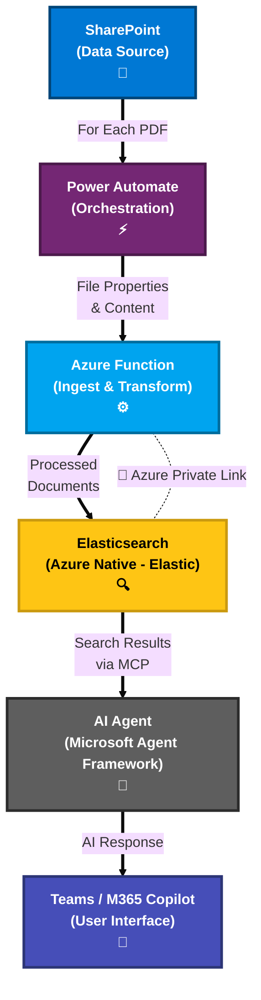

# 4. Vue d’ensemble de l’architecture de la solution

## Vue globale : Données → Agent IA → Teams

- Flux général :
  - SharePoint → Power Automate → Azure Function → Elasticsearch.
  - Agent IA (Microsoft Agent Framework) → Outils MCP → Teams/M365 Copilot.
- Principes clés :
  - Garder les données dans Azure.
  - Utiliser l’authentification d’entreprise et Teams pour l’accès utilisateur.
  - Ajouter une couche d’IA responsable pour la sécurité et la conformité.

