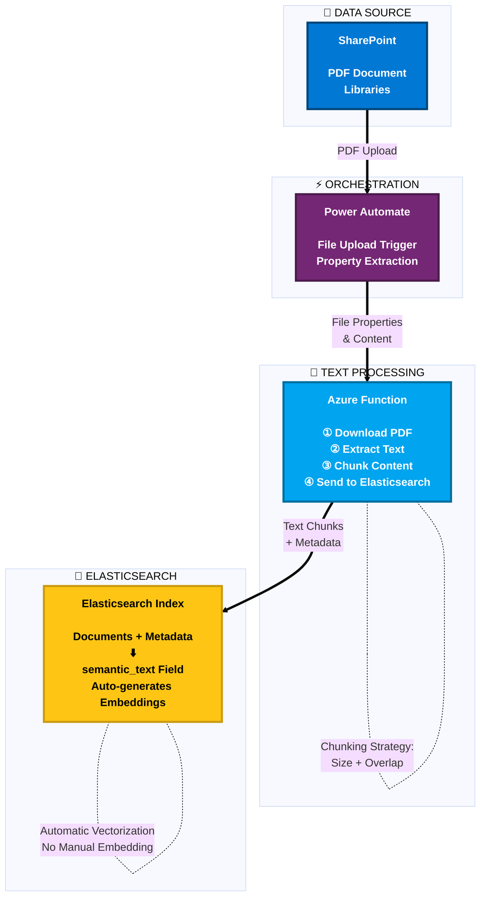

# 5. Pipeline d’ingestion

## Indexation des PDF : Power Automate + Azure Functions + Elastic

- Power Automate peut se déclencher lorsqu’un PDF est téléversé ou mis à jour dans SharePoint.
- Azure Function :
  - Récupère le PDF.
  - Extrait le texte et le segmente pour une meilleure recherche.
  - Envoie les segments à Elasticsearch pour l’indexation.
- Elastic génère automatiquement les embeddings via le champ `semantic_text`, ce qui réduit la complexité.
---

## Navigation

- [← Previous: Solution Architecture Overview](./04-architecture-overview.md)
- [Back to Demo Index](./README.md)
- [Next: Vectorization & Semantic Search →](./06-vectorization-semantic-search.md)
