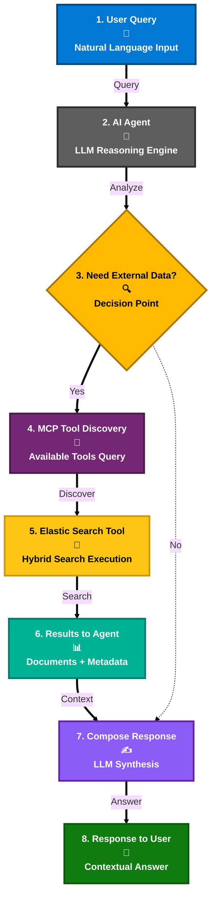

# 7. Création de l’agent IA

## Microsoft Agent Framework &amp; Conception orientée outils

### Azure AI Foundry

[Azure AI Foundry](https://azure.microsoft.com/en-us/products/ai-foundry) est la plateforme unifiée de Microsoft pour créer, évaluer et déployer des applications d’IA générative. Elle offre :

- **Développement d’agents** : Modèles préconstruits et SDK pour créer des agents IA  
- **Gestion des modèles** : Accès aux modèles OpenAI (GPT‑4o, GPT‑4o‑mini) et aux alternatives open‑source  
- **Intégration entreprise** : Connexion fluide avec les services Azure et M365  
- **Outils d’IA responsable** : Sécurité de contenu intégrée, protections de prompts et cadres d’évaluation  
- **Déploiement en production** : Infrastructure scalable pour les charges de travail IA d’entreprise  

### Microsoft Agent Framework

Le [Microsoft Agent Framework](https://devblogs.microsoft.com/foundry/introducing-microsoft-agent-framework-the-open-source-engine-for-agentic-ai-apps/) est un moteur open‑source qui alimente les applications IA agentiques avec :

- **Conversations multi‑tours** avec gestion d’état  
- **Appels d’outils &amp; orchestration** via Model Context Protocol (MCP)  
- **Réponses en streaming** pour des interactions en temps réel  
- **Support multi‑modèles** pour divers LLM  
- **Sécurité entreprise** et garde‑fous de sûreté du contenu  

### Fonctionnement dans cette solution

1. **Requête utilisateur** → L’agent analyse l’intention  
2. **Sélection d’outil** → Appelle dynamiquement les outils Elastic via MCP  
3. **Synthèse des résultats** → Combine les résultats de recherche avec le raisonnement LLM  
4. **Livraison de la réponse** → Renvoie des réponses contextualisées et justifiées  

