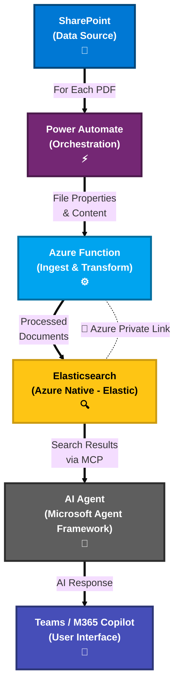

# 4. Solution Architecture Overview

## Big Picture: Data → AI Agent → Teams

- High-level flow:
  - SharePoint → Power Automate → Azure Function → Elasticsearch.
  - AI Agent (Microsoft Agent Framework) → MCP Tools → Teams/M365 Copilot.
- Key principles:
  - Keep data inside Azure.
  - Use enterprise authentication and Teams for user access.
  - Add a Responsible AI layer for safety and compliance.

---

## Navigation

- [← Previous: Why Elasticsearch for Vector Search](./03-why-elasticsearch.md)
- [Back to Demo Index](./README.md)
- [Next: Ingestion Pipeline →](./05-ingestion-pipeline.md)
