# 5. Ingestion Pipeline

## Indexing PDFs: Power Automate + Azure Functions + Elastic

- Power Automate can trigger when a PDF is uploaded or updated in SharePoint.
- Azure Function:
  - Fetches the PDF.
  - Extracts text and chunks it for better retrieval.
  - Sends chunks to Elasticsearch for indexing.
- Elastic automatically generates embeddings via `semantic_text` field, reducing complexity.
---

```mermaid
%%{init: {'theme':'base', 'themeVariables': { 'fontSize':'16px', 'fontFamily':'arial'}}}%%
flowchart TB
  subgraph Source["📁 DATA SOURCE"]
    SP["<b>SharePoint</b><br/><br/>PDF Document<br/>Libraries"]
  end

  subgraph Orchestration["⚡ ORCHESTRATION"]
    PA["<b>Power Automate</b><br/><br/>File Upload Trigger<br/>Property Extraction"]
  end

  subgraph Processing["🔧 TEXT PROCESSING"]
    AF["<b>Azure Function</b><br/><br/>① Download PDF<br/>② Extract Text<br/>③ Chunk Content<br/>④ Send to Elasticsearch"]
  end

  subgraph Storage["💾 ELASTICSEARCH"]
    ES["<b>Elasticsearch Index</b><br/><br/>Documents + Metadata<br/>⬇️<br/><b>semantic_text Field</b><br/>Auto-generates Embeddings"]
  end

  %% Flow
  SP ==>|PDF Upload| PA
  PA ==>|File Properties<br/>& Content| AF
  AF ==>|Text Chunks<br/>+ Metadata| ES

  %% Annotations
  AF -.-|Chunking Strategy:<br/>Size + Overlap| AF
  ES -.-|Automatic Vectorization<br/>No Manual Embedding| ES

  %% Styling with bold colors and high contrast
  classDef sourceStyle fill:#0078D4,stroke:#004578,stroke-width:3px,color:#fff,font-weight:bold;
  classDef orchestrationStyle fill:#742774,stroke:#4B1A4B,stroke-width:3px,color:#fff,font-weight:bold;
  classDef processingStyle fill:#00A4EF,stroke:#006D9E,stroke-width:3px,color:#fff,font-weight:bold;
  classDef storageStyle fill:#FEC514,stroke:#CB9A10,stroke-width:3px,color:#000,font-weight:bold;
  
  class SP sourceStyle;
  class PA orchestrationStyle;
  class AF processingStyle;
  class ES storageStyle;
```

## Navigation

- [← Previous: Solution Architecture Overview](./04-architecture-overview.md)
- [Back to Demo Index](./README.md)
- [Next: Vectorization & Semantic Search →](./06-vectorization-semantic-search.md)
