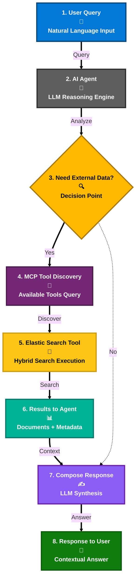

# 7. Building the AI Agent

## Microsoft Agent Framework & Tool-Oriented Design

### Azure AI Foundry

[Azure AI Foundry](https://azure.microsoft.com/en-us/products/ai-foundry) is Microsoft's unified AI platform for building, evaluating, and deploying generative AI applications. It provides:

- **Agent Development**: Pre-built templates and SDKs for creating AI agents
- **Model Management**: Access to OpenAI models (GPT-4o, GPT-4o-mini) and open-source alternatives
- **Enterprise Integration**: Seamless connectivity with Azure services and M365
- **Responsible AI Tools**: Built-in content safety, prompt shields, and evaluation frameworks
- **Production Deployment**: Scalable infrastructure for enterprise AI workloads

### Microsoft Agent Framework

The [Microsoft Agent Framework](https://devblogs.microsoft.com/foundry/introducing-microsoft-agent-framework-the-open-source-engine-for-agentic-ai-apps/) is an open-source engine that powers agentic AI applications with:

- **Multi-Turn Conversations** with state management
- **Tool Calling & Orchestration** via Model Context Protocol (MCP)
- **Streaming Responses** for real-time interactions
- **Multi-Model Support** across various LLMs
- **Enterprise Security** and content safety guardrails

### How It Works in This Solution

1. **User Query** → Agent analyzes intent
2. **Tool Selection** → Dynamically calls Elasticsearch search tools via MCP
3. **Result Synthesis** → Combines search results with LLM reasoning
4. **Response Delivery** → Returns contextual, grounded answers

### Extensibility

Supports adding new data sources, AI services, custom logic, and multi-agent patterns.

---

## Navigation

- [← Previous: Vectorization & Semantic Search](./06-vectorization-semantic-search.md)
- [Back to Demo Index](./README.md)
- [Next: Elastic MCP Integration →](./08-elastic-mcp-integration.md)
