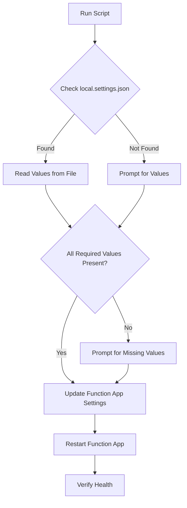

# Update Elasticsearch Secrets Script

## Overview

The `update-elasticsearch-secrets.sh` script updates Elasticsearch and Azure OpenAI configuration in your Azure Function App. It intelligently reads values from `local.settings.json` if available, eliminating the need for manual input.

## Features

- ✅ **Automatic configuration detection** - Reads from `local.settings.json` if present
- ✅ **Interactive prompts** - Only prompts for missing values
- ✅ **Multiple settings update** - Updates Elasticsearch URI, API Key, Index Name, and Azure OpenAI Inference ID
- ✅ **Automatic restart** - Restarts the function app to apply changes
- ✅ **Smart defaults** - Uses sensible defaults when values aren't provided

## Configuration Sources

The script looks for configuration values in the following order:

1. **local.settings.json** (preferred)
   - Location: `src/ElasticOn.RiskAgent.Demo.Functions/local.settings.json`
   - Values read: `ElasticsearchUri`, `ElasticsearchApiKey`, `ElasticsearchIndexName`, `AzureOpenAiInferenceId`

2. **Interactive prompts** (fallback)
   - Only prompts if values not found in local.settings.json
   - Required: ElasticsearchUri, ElasticsearchApiKey
   - Optional: ElasticsearchIndexName (defaults to `risk-agent-documents-v2`)

## Usage

### With local.settings.json (Recommended)

If your `local.settings.json` is properly configured, simply run:

```bash
./scripts/update-elasticsearch-secrets.sh
```

The script will:
1. Read all values from `local.settings.json`
2. Display what it found
3. Update the Azure Function App settings
4. Restart the function app

**Example output:**
```
🔐 Updating Elasticsearch configuration in Azure Function App...
🔍 Found Function App: azfunc7nnn24ozht26y in Resource Group: rg-risk-agent-dev

📖 Reading configuration from local.settings.json...
   ✓ Found ElasticsearchUri: https://your-cluster.es.eastus.azure.elastic.cloud:443
   ✓ Found ElasticsearchApiKey: [HIDDEN]
   ✓ Found ElasticsearchIndexName: risk-agent-documents-dev1
   ✓ Found AzureOpenAiInferenceId: azureopenai-text_embedding-g44f1t77ho

🔧 Updating Function App settings...
✅ Function App settings updated
```

### Without local.settings.json

If `local.settings.json` is not found or missing values, you'll be prompted:

```bash
./scripts/update-elasticsearch-secrets.sh
```

The script will prompt for:
```
📝 Enter your Elasticsearch URI: https://your-cluster.es.eastus.azure.elastic.cloud:443
📝 Enter your Elasticsearch API Key: your-api-key-here
📝 Enter your Elasticsearch Index Name (default: risk-agent-documents-v2): 
```

## Settings Updated

The script updates the following Azure Function App settings:

| Setting | Required | Source | Description |
|---------|----------|--------|-------------|
| `ElasticsearchUri` | ✅ Yes | local.settings.json or prompt | Elasticsearch cluster endpoint |
| `ElasticsearchApiKey` | ✅ Yes | local.settings.json or prompt | Elasticsearch API key for authentication |
| `ElasticsearchIndexName` | ⚠️ Optional | local.settings.json or prompt | Index name (default: risk-agent-documents-v2) |
| `AzureOpenAiInferenceId` | ⚠️ Optional | local.settings.json only | Azure OpenAI inference deployment ID |

## local.settings.json Format

Ensure your `local.settings.json` has the following structure:

```json
{
  "IsEncrypted": false,
  "Values": {
    "AzureWebJobsStorage": "UseDevelopmentStorage=true",
    "FUNCTIONS_WORKER_RUNTIME": "dotnet-isolated",
    "ElasticsearchUri": "https://your-cluster.es.eastus.azure.elastic.cloud:443",
    "ElasticsearchApiKey": "your-base64-encoded-api-key",
    "ElasticsearchIndexName": "risk-agent-documents-dev1",
    "AzureOpenAiInferenceId": "azureopenai-text_embedding-g44f1t77ho",
    "ChunkSize": "1000",
    "ChunkOverlap": "200"
  }
}
```

## Prerequisites

- Azure CLI installed and authenticated
- `jq` installed (for JSON parsing)
- Azure Developer CLI (azd) environment configured
- Function app already provisioned (`azd provision`)

## Workflow



## Verification

After running the script, verify the settings were applied:

```bash
# Check the updated settings
az functionapp config appsettings list \
  --name <function-app-name> \
  --resource-group <resource-group> \
  --query "[?name=='ElasticsearchUri' || name=='ElasticsearchIndexName'].{Name:name, Value:value}" \
  -o table

# Check function app health
curl https://<function-app-name>.azurewebsites.net/api/health
```

## Troubleshooting

### Script can't find local.settings.json

**Symptom:** Warning message: "⚠️ local.settings.json not found"

**Solution:** 
- Ensure you're running the script from the project root directory
- Check that `src/ElasticOn.RiskAgent.Demo.Functions/local.settings.json` exists

### jq command not found

**Symptom:** Error: "jq: command not found"

**Solution:**
```bash
# Ubuntu/Debian
sudo apt-get install jq

# macOS
brew install jq

# Windows (WSL)
sudo apt-get update && sudo apt-get install jq
```

### Settings not updating

**Symptom:** Settings appear to update but function app still uses old values

**Solution:**
- Wait 1-2 minutes after restart for changes to propagate
- Check Application Insights logs for any errors
- Verify settings in Azure Portal

### Function app health check fails

**Symptom:** Health endpoint returns 503 or error

**Solution:**
- Wait 2-3 minutes for the function app to fully restart
- Check if the deployment package is properly configured
- Run: `./scripts/verify-deployment.sh`

## Security Notes

⚠️ **Important Security Information:**

- Secrets are stored directly in Function App settings (not Key Vault)
- This is due to Key Vault reference limitations in Flex Consumption plans
- TODO: Migrate to Key Vault when better support is available
- The `local.settings.json` file contains secrets and should **never** be committed to git
- The file is in `.gitignore` by default

## Related Scripts

- `verify-deployment.sh` - Verifies the function app deployment
- `configure-function-key.sh` - Configures internal function keys
- `setup-azd-environment.sh` - Sets up the Azure Developer CLI environment

## Example: Complete Update Flow

```bash
# 1. Ensure you're in the project root
cd /home/mike/projects/elastic/fy26/risk-agent

# 2. Update your local.settings.json with new Elasticsearch credentials
# Edit: src/ElasticOn.RiskAgent.Demo.Functions/local.settings.json

# 3. Run the update script
./scripts/update-elasticsearch-secrets.sh

# 4. Wait for restart to complete
sleep 20

# 5. Verify the update
curl https://azfunc7nnn24ozht26y.azurewebsites.net/api/health

# 6. Test with a PDF
curl -X POST https://azfunc7nnn24ozht26y.azurewebsites.net/api/process-pdf \
  -H "Content-Type: application/json" \
  -d @samplePdfFileRequest.json
```

## Benefits

1. ✅ **No manual entry** - Reads from local development configuration
2. ✅ **Consistent configuration** - Same settings used locally and in Azure
3. ✅ **Quick updates** - Update all settings in one command
4. ✅ **Error prevention** - No typos from manual entry
5. ✅ **Audit trail** - All values visible in the script output
